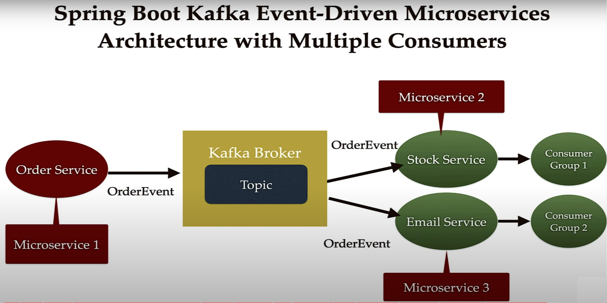

# springboot-kafka-microservices
springboot-kafka-microservices

**CURL to trigger order event from POSTMAN:**

curl --location 'http://localhost:8080/api/v1/orders' \
--header 'Content-Type: application/json' \
--data '{
    "orderId": "1",
    "name": "test",
    "qty": "1",
    "price": "1.1"
}'

